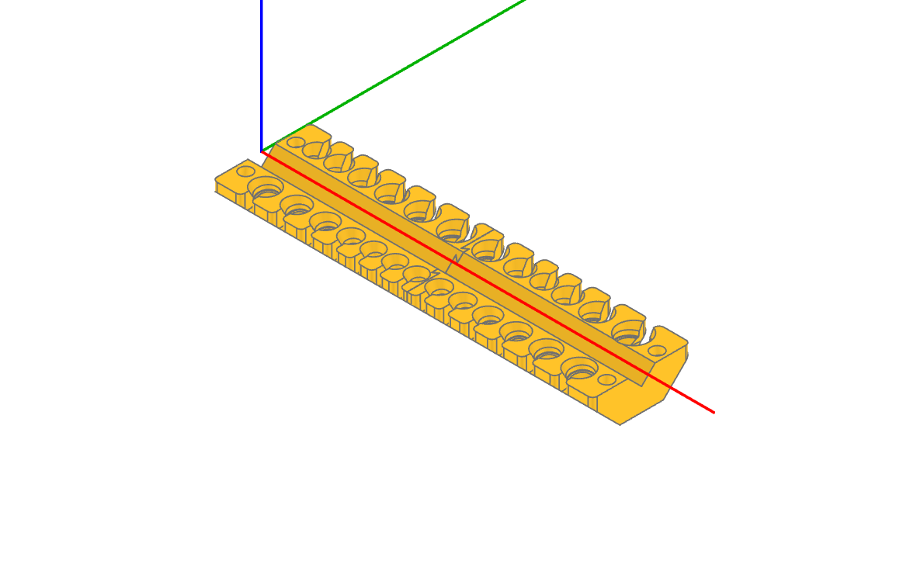

# Screwdriver-rack
Parameteric screwdriver rack with python, cadquery and a notebook. Each screwdriver fits snuggly in its own pocket. 

The rack is designed to be printed without support or infill. In the example provided the holder is cut in two halves using dovetail joints so it fits on my printer. 

I designed it to hold all my PB-Swiss screwdrivers, but it should work for most sets of screwdrivers. For each screwdriver only the shaft and handle diameter need to be provided.

Also on [printables](https://www.printables.com/model/731096-screwdriver-rack-paramateric-cadquery-pb-swiss)

## Usage

Install [jupyter-cadquery](https://github.com/bernhard-42/jupyter-cadquery) and run the [notebook](screw-driver-rack.ipynb). Cadquery can be a bit hairy, but I did my best to make the notebook somewhat legible.
